# Threats To MITRE(CWD, ATT&CK) AI-LLM Mapper

**Program Design Purpose**: The primary objective of this program is to leverage AI-LLM technology to streamline the processing of human language-based threat scenario documents, including technical blogs, CTI reports, online threats introduction materials and cyber attack training notes. The goal is to succinctly summarize the attack flow path outlined within such materials via mapping the attack behaviors to the MITRE-ATT&CK Matrix and matching the vulnerabilities to the MITRE-CWE Tree. 

To achieve this, the program will undertake the following tasks:

- **Identifying Cyber Attack Behaviors**: The program will parse the document to extract cyber attack behaviors, delineating each behavior individually. Subsequently, it will map these behaviors to the MITRE ATT&CK Matrix, thereby discerning the associated attack tactics and techniques.
- **Detecting Vulnerabilities**: Additionally, the program will identify vulnerabilities mentioned within the threat descriptions. It will then cross-reference these vulnerabilities with the MITRE Common Weakness Enumeration (CWE) to establish corresponding matches.

Upon completion of the mapping and matching processes, the program will automate the generation of a comprehensive report detailing the outcomes of these activities. This report will serve to provide valuable insights into the cyber threat landscape outlined in the original documents.

The general program system view (General workflow, MITRE Mapper and Matcher Web UI) is shown below:

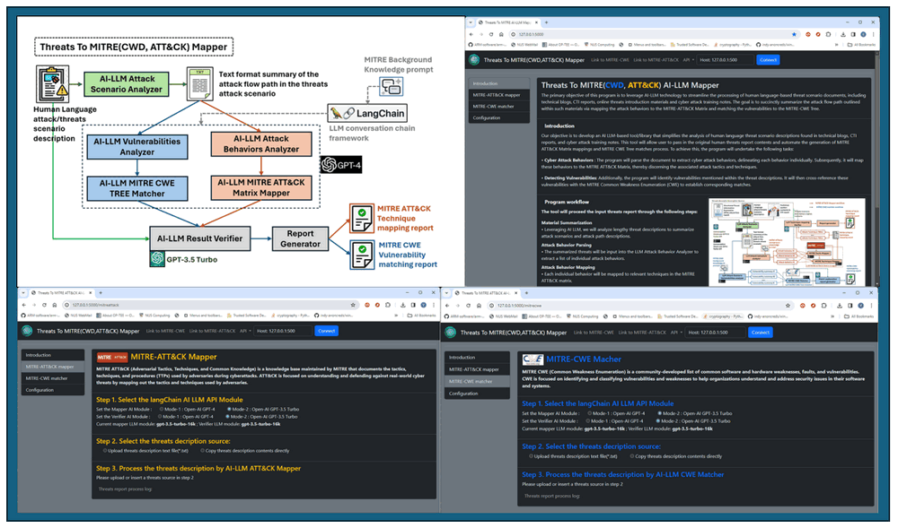

Version `v0.1.1`

**Table of Contents**

[TOC]

------

### Introduction

While there are several threat analysis tools available in the market, such as [ThreatMapper](https://www.deepfence.io/threatmapper) and [CRITs (Collaborative Research Into Threats)](https://crits.github.io/), many of them require users to be well-versed in two industry-standard-threats protocols like STIX and TAXII. Users must employ STIX (Structured Threat Information eXpression) for creating accuracy threat description, then connect to the analysis tool's services with TAXII (Trusted Automated Exchange of Indicator Information) to facilitate the exchange of cyber threat intelligence. This prerequisite can steepen the learning curve for users.

Our objective is to develop an AI LLM-based tool/library that simplifies the analysis of human language threat scenario descriptions found in technical blogs, CTI reports, and cyber attack training notes. This tool will allow user to pass in the original human threats report contents and automate the generation of MITRE ATT&CK Matrix mappings and MITRE CWE Tree matches process. The general program workflow is shown below:


The tool will proceed the input threats report through the following steps:

1. **Material Summarization**: Leveraging AI LLM, we will analyze lengthy threat descriptions to summarize attack scenarios and attack path descriptions.
2. **Attack Behavior Parsing**: The summarized threats will be input into the LLM Attack Behavior Analyzer to extract a list of individual attack behaviors.
3. **Attack Behavior Mapping**: Each individual behavior will be mapped to relevant techniques in the MITRE ATT&CK matrix.
4. **Result Verification**: Different AI LLM models will be employed to verify if the results match the original contents of the threat material.
5. **Report Generation**: Based on verified results, the program will generate mapping reports for further research and development purposes.

**Remark:** The five steps analyze introduced in our program are an automation of the ( 6 steps ) introduced in the Threat Intelligence mapping example shown in the  MITRE-ATT&CK official document (page6 Example of FireEye report that’s been mapped to ATT&CK): https://www.mitre.org/sites/default/files/2021-11/getting-started-with-attack-october-2019.pdf

The program provide command console interface and the web interface for user to use, the web UI is shown below:


To check the detail usage, please refer to this video: https://youtu.be/NoGy8Z5xXWE?si=uPeHbf80kpgez1d9


------

### Project Design 

In the MITRE ATT&CK official document (2019 Page 6), an example illustrates the mapping of threats from a "FireEye" report to the MITRE ATT&CK Matrix, as depicted below:


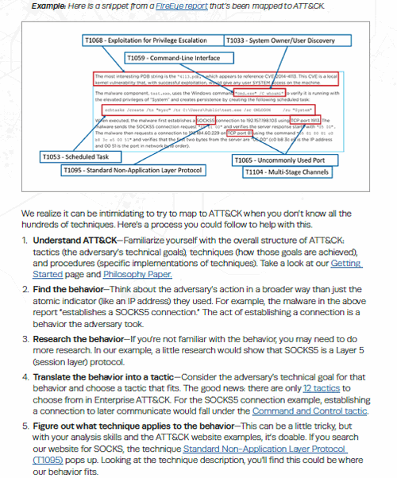

The document outlines six general steps for analyzing the report :

1. **Understanding ATT&CK**: Familiarizing oneself with the principles and structure of the MITRE ATT&CK framework.
2. **Identifying Behaviors**: Identifying and isolating specific behaviors outlined in the threat report.
3. **Conducting Research on Behaviors**: Conducting further research to gain deeper insights into the identified behaviors.
4. **Translating Behaviors into Tactics**: Associating the identified behaviors with relevant tactics within the ATT&CK framework.
5. **Determining Applicable Techniques**: Identifying techniques within the framework that are applicable to the behaviors under scrutiny.
6. **Comparing Results with Other Analysts**: Comparing the results of the analysis with those of other analysts to validate findings and ensure consistency.


#### Design of Threats To MITRE(CWD, ATT&CK) Mapper

Our program leverages LLM (Large Language Model) with prompt engineering to automate the six steps required to generate mapping reports. The workflow of the program is depicted below:

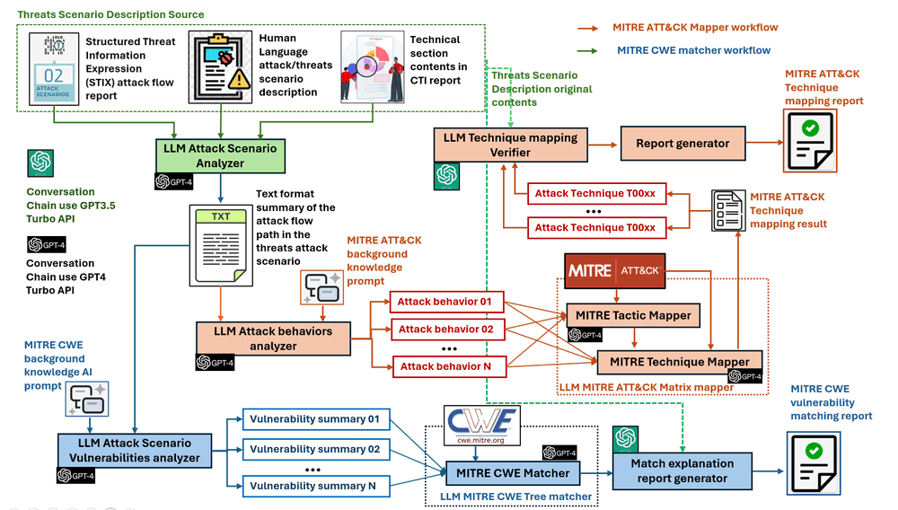


We use `LLM Attack Scenario Analyzer` module to analyze the human language threat scenario descriptions, thereby generating a summarized attack flow. The following steps are then followed to either map the threats to MITRE ATT&CK or match them to MITRE CWE:

**Mapping to MITRE ATT&CK:**

- **Understanding ATT&CK**: The program initiates a MITRE ATT&CK background knowledge prompt within the LLM conversation chain to ensure the AI comprehends the task requirements.
- **Identifying Behaviors**: The `LLM Attack Behaviors Analyzer` module parses the attack flow summary to extract individual attack behaviors/actions.
- **Translating Behaviors into Tactics**: Utilizing the `MITRE Tactic Mapper` module, the program searches for MITRE Matrix Tactics corresponding to each attack action.
- **Determining Applicable Techniques**: The `MITRE Technique Mapper` module examines the Tactics to identify applicable techniques for each behavior.
- **Result Verification**: Subsequently, the `LLM Technique Mapping Verifier` module maps the techniques back to the original threat report to validate accuracy.

**Matching to MITRE-CWE:**

- **Understanding CWE**: Similar to the ATT&CK mapping process, a MITRE-CWE background knowledge prompt is provided to the LLM conversation chain.

- **Identifying Vulnerabilities**: The `LLM Attack Scenario Vulnerabilities Analyzer` module identifies relevant vulnerabilities within the attack flow summary.

- **Mapping to CWE Categories**: The `MITRE CWE Matcher` module matches each vulnerability to the closest weakness category in MITRE CWE.

- **Result Verification**: After obtaining the CWE match result, the verifier module compares it with the original threat report to confirm accuracy.

  

Remark: The program will automate generate the analyze result report under JSON format, we allow the user to apply different AI modules on the verifier module to make the final result persuasive. 

The report will flow below  example format: 

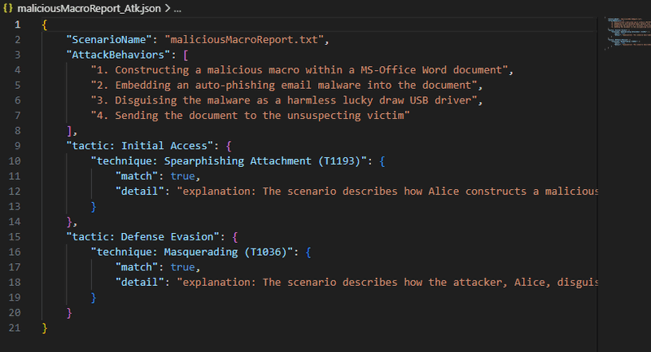


------

### Background Knowledge


#### MITRE CWE and ATT&CK

MITRE Common Weakness Enumeration (CWE) and MITRE ATT&CK (Adversarial Tactics, Techniques, and Common Knowledge) are two distinct frameworks developed by MITRE, each serving different purposes in the realm of cybersecurity:

- The CWE is category based frame work focuses on cataloging vulnerabilities and weaknesses (CVE). 
- The ATT&CK is knowledge based frame work focuses on documenting adversary behaviors and techniques (TTP).

The main difference and relationship between the MITRE CWE and ATT&CK is shown below:


##### MITRE CWE (Common Weakness Enumeration)

- CWE is a community-developed list of common software and hardware weaknesses, faults, and vulnerabilities.
- CWE provides a standardized taxonomy for categorizing and describing various types of security weaknesses that can lead to vulnerabilities in software and systems.
- Each CWE entry includes a unique identifier, a description of the weakness, examples, potential consequences, and mitigations.
- CWE is focused on identifying and classifying vulnerabilities and weaknesses to help organizations understand and address security issues in their software and systems.

##### MITRE ATT&CK (Adversarial Tactics, Techniques, and Common Knowledge)

- ATT&CK is a knowledge base maintained by MITRE that documents the tactics, techniques, and procedures (TTPs) used by adversaries during cyberattacks.
- ATT&CK provides a structured framework for understanding and categorizing adversary behaviors across the entire lifecycle of a cyberattack, from initial reconnaissance to data exfiltration.
- ATT&CK is organized into a matrix format, with tactics represented along the top row and techniques listed within each tactic.
- Each technique includes detailed information about how adversaries execute it, potential detection methods, and mitigations.
- ATT&CK is focused on understanding and defending against real-world cyber threats by mapping out the tactics and techniques used by adversaries.


#### Large Language Models Prompt Engineering

LLM (Large Language Models) prompt engineering refers to the process of crafting or designing input prompts to effectively elicit desired responses from language models like GPT (Generative Pre-trained Transformer). With LLMs, the prompt plays a crucial role in guiding the model to generate relevant and coherent outputs. Prompt engineering involves considering various factors such as the wording, structure, context, and task-specific instructions to optimize the performance of the model.

Effective prompt engineering can significantly influence the quality, relevance, and coherence of the generated text. It involves understanding the capabilities and limitations of the language model being used and tailoring the prompts accordingly to achieve specific goals, such as generating creative stories, answering questions, completing tasks, or providing relevant information.

This process often involves experimentation, iteration, and fine-tuning to find the most effective prompts for a given task or application. Prompt engineering is particularly important in applications such as natural language understanding, text generation, chatbots, and language-based AI systems, where the quality of the generated text directly impacts user experience and task performance.

In this program we use the language chain tool langchain https://www.langchain.com/langchain to build the continues conversation with the `OpenAI GPT4` and `OpenAI GPT-3.5 Turbo`. If you want to use other LLM such as the google bard please refer to the langchain API document. 


------

### Program Usage/Execution

We offer two interfaces for users to utilize the program: a console command interface and a web interface. Before utilizing the program, it's essential to configure your OpenAI keys in the `config.txt` file.

```
# This is the config file template for the module <threats2MitreUtils.py>
# Setup the parameter with below format (every line follow <key>:<val> format, the
# key cannot be changed):

# set openAI API key
API_KEY:<openAI key>

# set the AI model apply to the mapper.
AI_MODEL:<GPT-4>

# set the AI model apply to the verifier, if not set program will use the same as the mapper.
VF_KEY:<openAI key>
VF_AI_MODEL:<gpt-3.5-turbo-16k>

# Scenario bank folder (folder to store the threats report srource)
SCE_BANK:ScenarioBank

# Output folder (folder to store the threats report)
RST_FOLDER:ReportFolder

#-----------------------------------------------------------------------------
# Init the Flask app parameters
FLASK_SER_PORT:5000
FLASK_DEBUG_MD:False
FLASK_MULTI_TH:True
```


#### Use the MITRE-Mapper From Console

**Step1**: Run the command interface program via command: 

```
python3 threats2MitreRun.py
```

**Step2**: Copy the threats description file to the `ScenarioBank` folder as you set in the config file . Select the function and fill in the threats report source in program as shown below: 

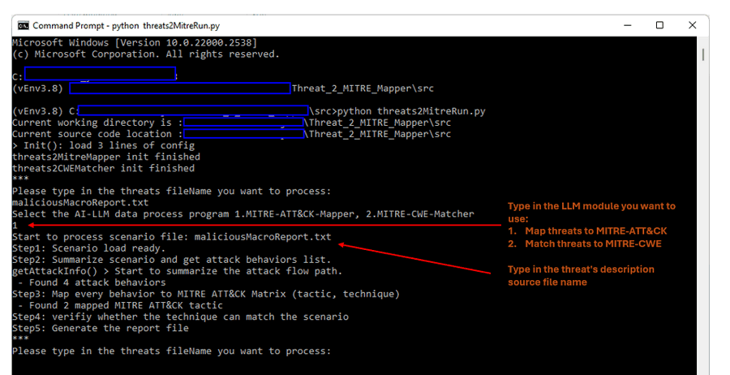

**Step3**: The report will be generated in the `RST_FOLDER` folder you set in the config file, then check the repot file `maliciousMacroReport_Atk.json` contents: 

```
{
    "ScenarioName": "maliciousMacroReport.txt",
    "AttackBehaviors": [
        "1. Constructing a malicious macro within a MS-Office Word document",
        "2. Embedding an auto-phishing email malware into the document",
        "3. Disguising the malware as a harmless lucky draw USB driver",
        "4. Sending the document to the unsuspecting victim"
    ],
    "tactic: Initial Access": {
        "technique: Spearphishing Attachment (T1193)": {
            "match": true,
            "detail": "explanation: The scenario describes how Alice constructs a malicious macro within a MS-Office Word document and embeds an auto-phishing email malware into the document. This is a classic example of a spearphishing attack where the attacker sends a malicious attachment (the Word document) to the victim (Bob) in an attempt to trick them into opening it and executing the embedded malware."
        }
    },
    "tactic: Defense Evasion": {
        "technique: Masquerading (T1036)": {
            "match": true,
            "detail": "explanation: The scenario describes how the attacker, Alice, disguises the malware as a harmless lucky draw USB driver. This is an example of masquerading, where the attacker attempts to make the malware appear as something legitimate or benign to deceive the victim."
        }
 }
```


#### Use the MITRE-ATT&CK-Mapper From Web Interface 

This section will show how to upload a threats scenario file and use the MITRE-ATT&CK mapper web interface. (You can also paste the threats scenario description directly)

**Step1**: Run the command interface program via command: 

```
python3 threats2MitreRun.py
```

Open the browser and access the URL: http://127.0.0.1:5000/ and select the "MITRE-ATT&CK mapper" : 

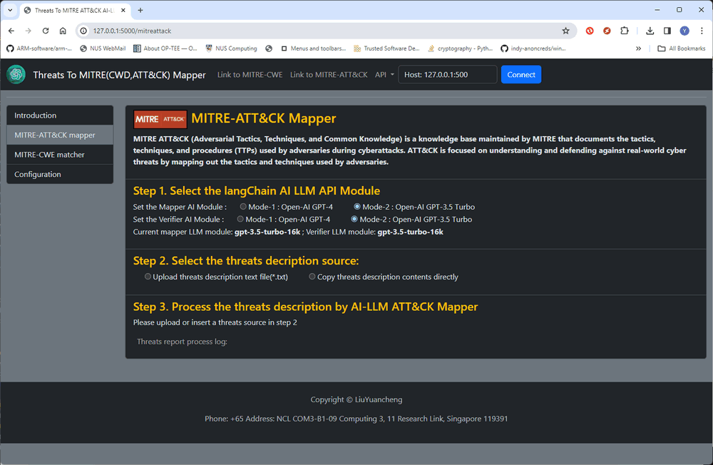

**Step2**: Follow the web page instruction to set up the mapper AI module and verifier module , then upload the threats description file and press the "Upload" button.(As shown below) 

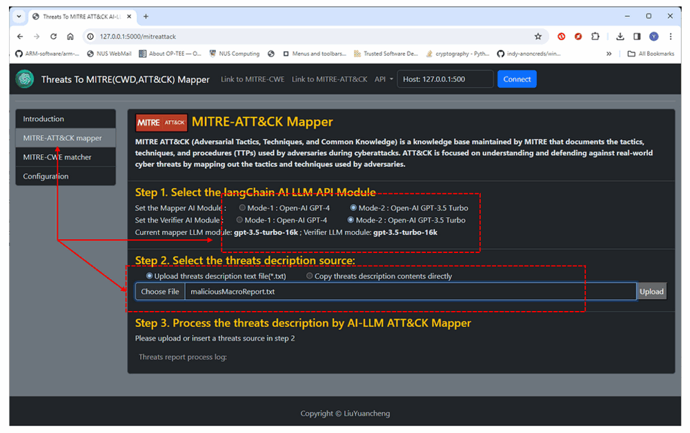

**Step3**: After upload finished, the process start button will show up then press the "Start" button to start the process.  When the process finished, the browser will automated download the *.json format report. (As shown below, the report's file name will be under format `<uploadfilename>_Report_Atk_YYYY_MM_DD.json` )

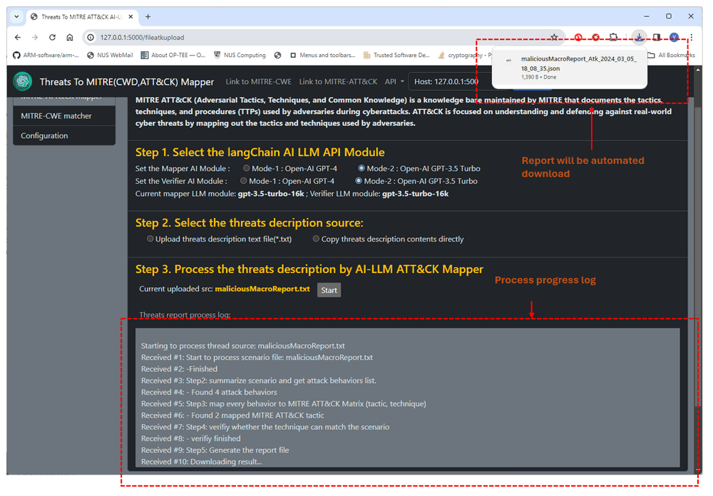


#### Use the MITRE-CWE-Matcher From Web Interface 

This section will show how to paste threats scenario contents directly to the web and use the MITRE-CWE matcher web interface.(You can also do the matching via upload the  threats scenario file)

**Step1**: Run the command interface program via command: 

```
python3 threats2MitreRun.py
```

Open the browser and access the URL: http://127.0.0.1:5000/ and select the "MITRE-CWE matcher" : 

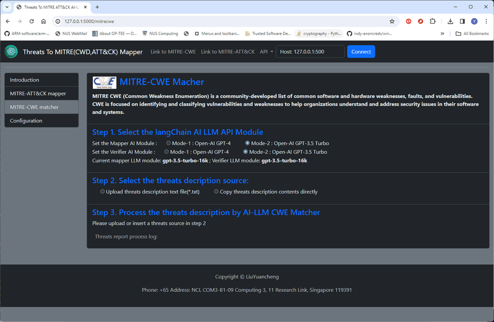

**Step2**: Follow the web page instruction to set up the mapper AI module and verifier module , then paste the contents directly in the text field and press the "Upload" button.(As shown below) 

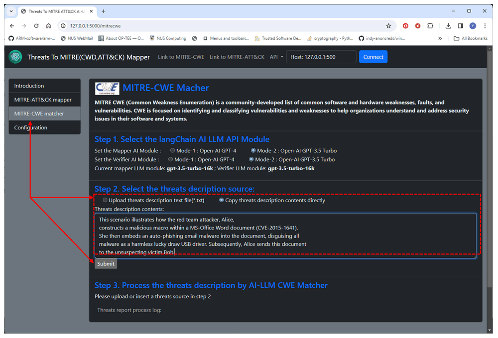

**Step3**: After upload finished, the process start button will show up then press the "Start" button to start the process.  When the process finished, the browser will automated download the *.json format report. (As shown below, the report's file name will be under format `tempScenarioFile_Cwe_YYYY_MM_DD.json` )

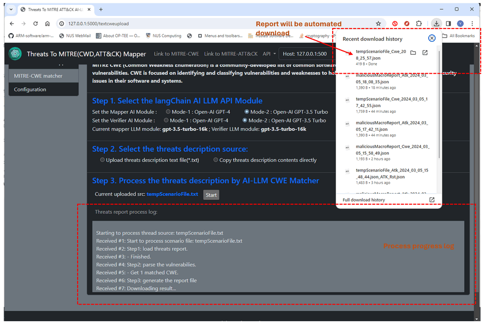


------

> Last edit by LiuYuancheng(liu_yuan_cheng@hotmail.com) at 03/01/2024, , if you have any problem please free to message me.
